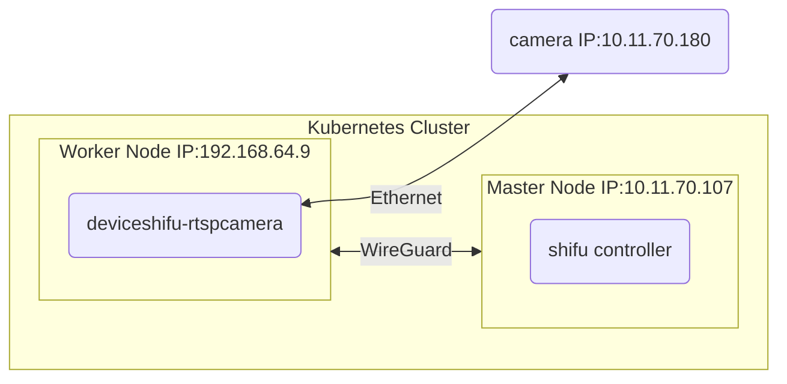

# Step 1: Deploy the RTSP Camera

## Architecture



## Deploy the deviceShifu

```bash
kubectl apply -f camera.yaml
```

## Check the NodePort of the deviceShifu

```bash
kubectl  get svc -n deviceshifu
```

## Open in browser

```text
192.168.64.9:{PORT}
```

## (Optional)Port-forward to view in browser

```text
kubectl port-forward -n deviceshifu svc/deviceshifu-rtspcamera 30080: --address 0.0.0.0
localhost:30080
```
