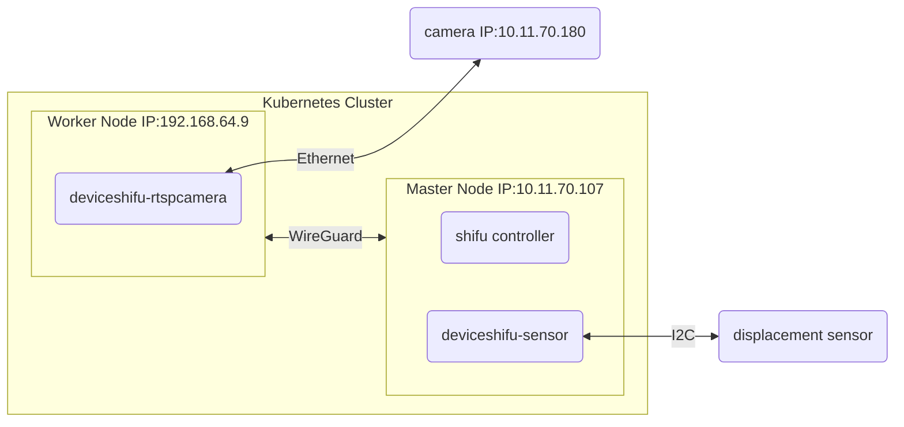

# Step 2: Connect the displacement sensor

## Architecture



## build and scp the image

```bash
docker build -t displacement-sensor:v0.0.1 .
docker save displacement-sensor:v0.0.1 > displacement-sensor.tar.gz
scp displacement-sensor.tar.gz  raspberrypi@10.11.70.107:
```

## import the image

```bash
sudo ctr images import displacement-sensor.tar.gz
```

## deploy the sensor

```bash
kubectl apply -f sensor.yaml
```

## check in browser

```bash
http://10.11.70.107:{PORT}/sensor
```
