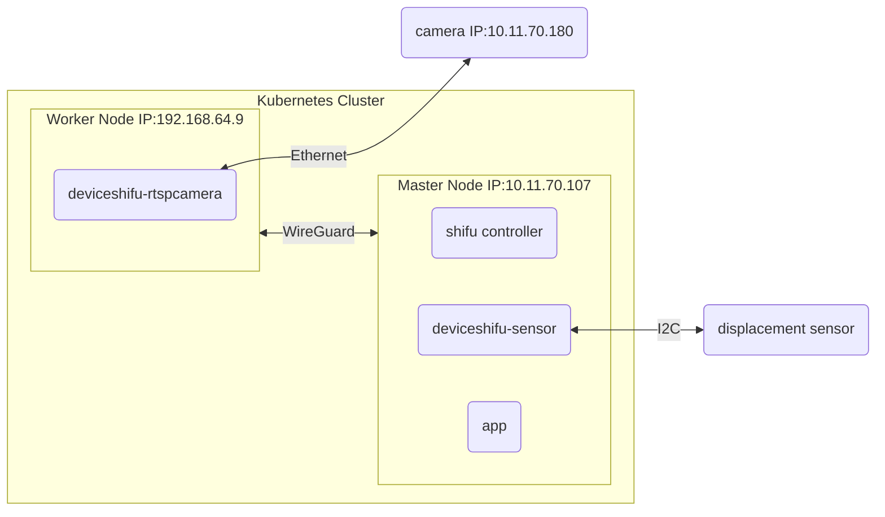

# Step 3: Building an application on top of Shifu

## Architecture



## Requirement

When the displacement sensor detects displacement beyond a threshold, the app should log it and use the camera to take a picture of the object.

## Build and deploy the app

```bash
docker build -t app:v0.0.1 .
docker save app:v0.0.1 > app.tar.gz
scp app.tar.gz  raspberrypi@10.11.70.107:
## for multipass node, use the following
# multipass transfer app.tar.gz k3s:
```

## import the image

```bash
sudo ctr images import app.tar.gz
```

## deploy the app

```bash
kubectl apply -f app.yaml -n deviceshifu
```

## check in browser

```text
10.11.70.107:{PORT}/images
# or
192.168.64.9:{PORT}/images
```

## logs

```bash
kubectl logs -n deviceshifu -l=app=myapp -f
```
