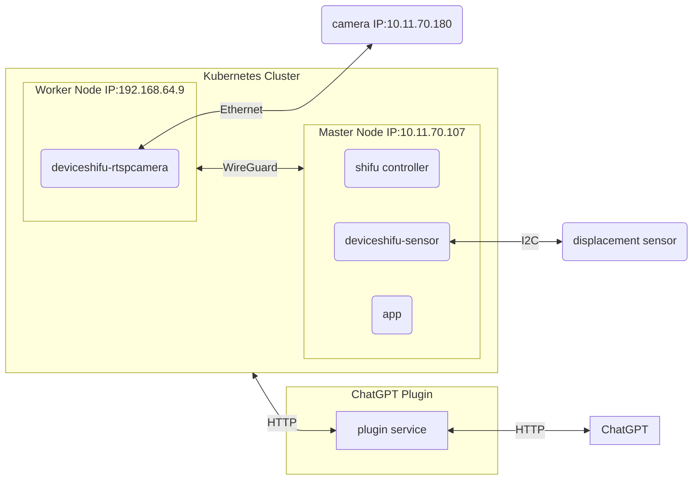

# Step 4: Use ChatGPT to control your IoT devices

## Architecture



## Clone the repository

```bash
git clone https://github.com/Edgenesis/shifu-plugin-for-chatgpt.git
```

## update `main.py` with the following

update `main.py` for the actual URL from `kubectl get svc -n deviceshifu`

In my case, IP `192.168.64.9` for camera host and `10.11.70.107` for sensor host

**Modity to actual IP from NodePort**

```python
CAMERA_URL = "http://192.168.64.9:{PORT}"
SENSOR_URL = "http://10.11.70.107:{PORT}"
```

sensor API:

```python
@app.route('/sensor', methods=['GET'])
async def sensor():
    print("Sensor request received:", request)
    async with aiohttp.ClientSession() as session:
        async with session.get(SENSOR_URL + '/sensor') as resp:
            info_data = await resp.read()
            return Response(info_data, content_type='text/json')
```

## Update `openapi.yaml` with the following

### Description and Title

```yaml
  title: IP Camera Control and sensor reading API
  description: API to access and control an IP camera, allowing users to view the camera feed, move the camera in various directions, and get information about the camera. Also allow us to read value from a displacement sensor
```

### API

```yaml
  /sensor:
    get:
      operationId: getSensorInfo
      summary: Get reading from the displacement sensor
      responses:
        "200":
          description: OK
          content:
            application/json:
              schema:
                $ref: '#/components/schemas/SensorInfo'
        "400":
          description: Failed to read from the device
```

```yaml
    SensorInfo:
      type: string
      description: JSON-formatted information about the displacement sensor.
```

## reimport the plugin on ChatGPT

URL

```
http://localhost:3333
```

## Build

```bash
docker build -t shifu-plugin-for-chatgpt:v0.0.1 .
docker save shifu-plugin-for-chatgpt:v0.0.1 > shifu-plugin-for-chatgpt.tar.gz
scp shifu-plugin-for-chatgpt.tar.gz  raspberrypi@10.11.70.107:
## for multipass node, use the following
# multipass transfer shifu-plugin-for-chatgpt.tar.gz k3s:
```

## import the image

```bash
sudo ctr images import shifu-plugin-for-chatgpt.tar.gz
```

## deploy the plugin

```bash
kubectl apply -f plugin.yaml -n deviceshifu
```

## check in browser

```text
10.11.70.107:{PORT}
# or
192.168.64.9:{PORT}
```